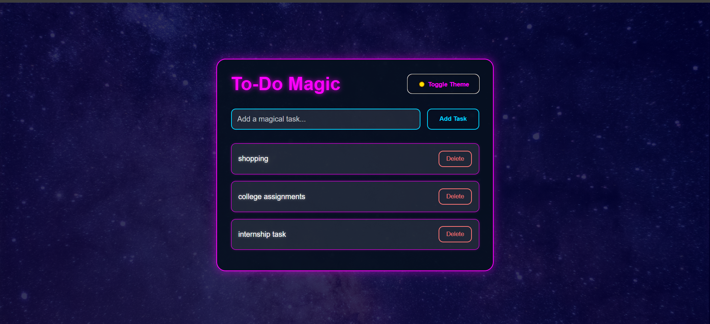
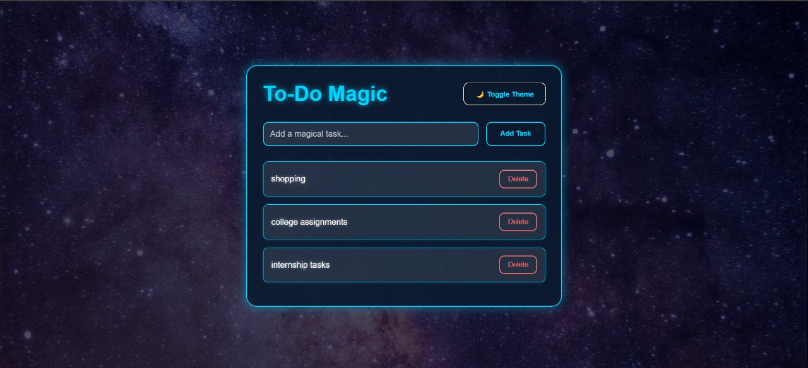

# Task-2
# To-Do Magic 🚀

A dynamic and visually stunning To-Do List web application built with vanilla JavaScript, HTML, and CSS. This app features a cosmic space theme with glowing effects, a toggleable dark/light mode, and smooth animations for adding and removing tasks. Perfect for managing your daily tasks while feeling like you're exploring the galaxy!

## Features

- **Add Tasks**: Easily add new tasks with a futuristic input field.
- **Mark as Complete**: Click on a task to toggle its completion status.
- **Delete Tasks**: Remove tasks with a satisfying pop-out animation.
- **Dark/Light Mode**: Toggle between a cyan-themed light mode and a magenta-themed dark mode for a cosmic experience.
- **Space Theme**: Enjoy a starry background with glowing borders and a sci-fi aesthetic.
- **Responsive Design**: Works seamlessly on both desktop and mobile devices.
- **Dynamic Updates**: No page reloads—everything updates instantly via DOM manipulation.

## Screenshots

 

